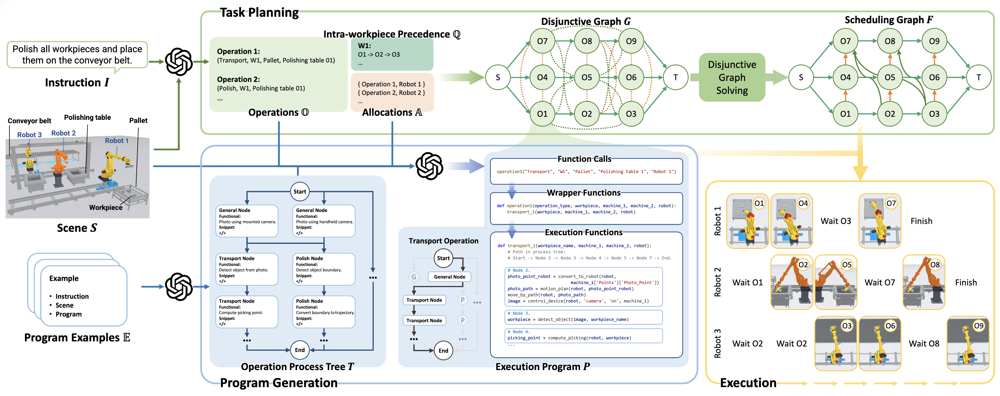
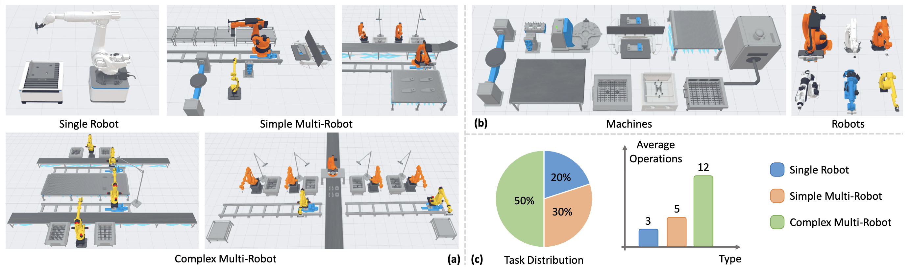

<div align="center">

# IMR-LLM: Industrial Multi-Robot Task Planning and Program Generation using Large Language Models

</div>

<p align="center">
  <a href="https://arxiv.org/abs/2603.02669"></a>
  <a href="https://xiangyusu611.github.io/imr-llm/"></a>
  <a href="https://img.shields.io/badge/Conference-ICRA%202026-blue.svg?style=for-the-badge"></a>
  <a href="LICENSE"></a>
</p>

<p align="center">
  Xiangyu Su •
  <a href="https://juzhan.github.io/">Juzhan Xu</a> •
  <a href="https://carleton.ca/scs/people/oliver-van-kaick/">Oliver van Kaick</a> •
  <a href="https://kevinkaixu.net/">Kai Xu</a> •
  <a href="https://csse.szu.edu.cn/staff/ruizhenhu/">Ruizhen Hu</a>
</p>

<div align="center">
  
</div>


---

## 📢 News

> **[2026-01]** 🎉 IMR-LLM has been accepted to **ICRA 2026**! Code coming soon!


---

## 🛠️ Method Overview

<div align="center">
  
</div>

Our pipeline consists of two main stages:

1. **Task Planning** — Given an instruction *I*, an industrial scene *S*, and program examples *E*, we decompose operations, assign robots, and schedule operations using a disjunctive graph and a heuristic solver.
2. **Program Generation** — Translate the high-level plan into executable Python code under the guidance of an operation process tree.

---

## 📊 IMR-Bench

IMR-Bench is built upon the SpeedBot KunWu platform, comprising scenes and tasks collected from real industrial environments by production line design experts.

| Level | Robots | Operations | Execution |
|-------|--------|------------|-----------|
| Single Robot Task | 1 | Up to 5 | Sequential |
| Simple Multi-Robot Task | Up to 3 | Up to 10 | Parallel or Sequential |
| Complex Multi-Robot Task | Up to 7 | Up to 24 | Mixed |

<div align="center">
  
</div>

---

## 📈 Results

IMR-LLM achieves state-of-the-art performance across all metrics on IMR-Bench.

| Methods | Single: OC↑ | SE↑ | SR↑ | Simple: OC↑ | SE↑ | SR↑ | Complex: OC↑ | SE↑ | SR↑ |
|---------|:-----------:|:---:|:---:|:-----------:|:---:|:---:|:------------:|:---:|:---:|
| SMART-LLM | 0.83 | 0.70 | 0.50 | 0.67 | 0.46 | 0.20 | 0.50 | 0.04 | 0.00 |
| LaMMA-S | 0.80 | 0.80 | 0.70 | 0.71 | 0.67 | 0.33 | 0.56 | 0.26 | 0.16 |
| LaMMA-O | 0.80 | 0.80 | 0.80 | 0.71 | 0.67 | 0.46 | 0.56 | 0.26 | 0.20 |
| LiP-O | **1.00** | **1.00** | 0.90 | 0.93 | 0.80 | 0.73 | 0.63 | 0.28 | 0.24 |
| **Ours (GPT-4o)** | **1.00** | **1.00** | 0.90 | **1.00** | **1.00** | **0.87** | **0.88** | **0.75** | **0.68** |
| **Ours (Qwen3-32B)** | **1.00** | **1.00** | **1.00** | **1.00** | 0.93 | **0.87** | 0.85 | 0.71 | 0.60 |

> OC: Operation Correctness | SE: Scheduling Efficiency | SR: Success Rate

---

## 🎬 Demo Videos

**Simulated Environment**

- [Single Robot Task](https://www.youtube.com/watch?v=E3EhAjwfA7I)
- [Simple Multi-Robot Task](https://www.youtube.com/watch?v=-2nqirsmZeU)
- [Complex Multi-Robot Task](https://www.youtube.com/watch?v=ZqEw63z2ZTA)

**Real-World Application**

- [Real Robot Demonstration](https://www.youtube.com/watch?v=dUbpFu8XMss)

---

## 📋 Open Source Roadmap

> We are committed to making IMR-LLM open source! Here is our release plan:

### 🎯 Phase 1: Core Release

<details open>
<summary><b>Inference Code</b> - Task planning and program generation pipeline</summary>

- [ ] Task planning with disjunctive graph construction
- [ ] Program generation with process tree guidance
- [ ] Demo scripts

</details>

<details open>
<summary><b>IMR-Bench</b> - Benchmark dataset and evaluation</summary>

- [ ] Benchmark task definitions and scenes
- [ ] Evaluation scripts and metrics

</details>

### 🔧 Phase 2: Full Release

<details>
<summary><b>Training & Configuration</b></summary>

- [ ] Prompt templates and few-shot examples
- [ ] Scene configuration files
- [ ] Dataset preparation guide

</details>

---

## 🔧 Installation

```bash
# Clone the repository
git clone https://github.com/xiangyusu611/IMR-LLM.git
cd IMR-LLM

# Install dependencies
pip install -r requirements.txt
```

---

## 🚀 Quick Start

```bash
# Coming soon
```

---

## 📖 Citation

If you find IMR-LLM useful in your research, please consider citing:

```bibtex
@article{su2026imrllm,
  title     = {IMR-LLM: Industrial Multi-Robot Task Planning and
               Program Generation using Large Language Models},
  author    = {Su, Xiangyu and Xu, Juzhan and van Kaick, Oliver
               and Xu, Kai and Hu, Ruizhen},
  journal   = {arXiv preprint arXiv:2603.02669},
  year      = {2026}
}
```

---

<div align="center">

**Thank you for your interest in IMR-LLM!**

⭐ Star this repo if you find it interesting!

</div>
